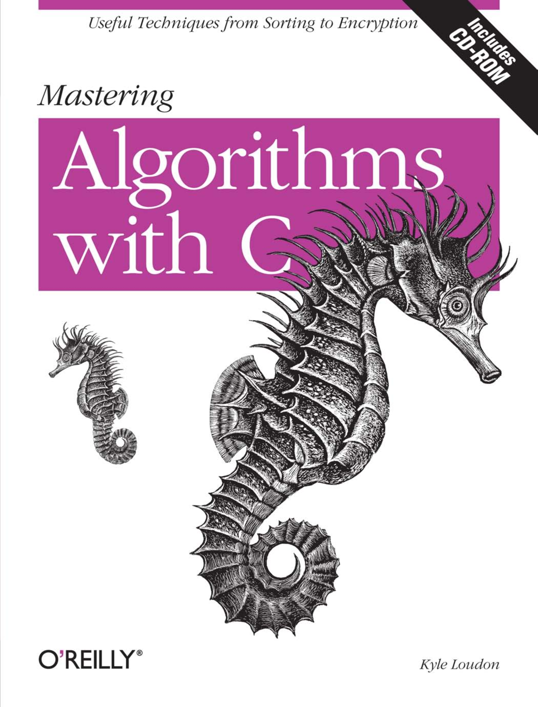

# LearningMasteringAlgorithms-C
Mastering Algorithms With C: 《算法精解：C语言描述》

## 目录说明

- learning_src: 学习代码(中文注释)

    - [./learning_src/examples](./learning_src/examples)
    - [./learning_src/include](./learning_src/include)
    - [./learning_src/source](./learning_src/source)

- learning_notes: 学习笔记

    - [./image](./image)
    - [./Google C++ Style Guide.pdf](./learning_notes/Google%20C++%20Style%20Guide.pdf)
        Google C++ 编程风格指南
    - [《跟我一起写 Makefile (PDF 重制版)》](./learning_notes/Makefile.pdf)
    - ...

- book: 电子书及原书代码

    - [./book/examples_pc](./book/examples_pc)
    - [./book/examples_unix](./book/examples_unix)

    - [./book/Oreilly.Mastering.Algorithms.with.C.pdf](./book/Oreilly.Mastering.Algorithms.with.C.pdf)
        原书英文版 PDF格式

    - [./book/算法精解：C语言描述(中文版).pdf](./book/算法精解：C语言描述(中文版).pdf)
        原书中文影印版 PDF格式

    - [./book/README.md](./book/README.md)
    - [./book/logo.png](./book/logo.png)

## 编程规范 && 辅助文档

- 代码规范&&参考

    [《Google 开源项目风格指南 (中文版)》](https://zh-google-styleguide.readthedocs.io/en/latest/)

- 源码构建&&测试

    examples 测试环境: linux GCC/CC

    Makefile 语法&&规则 : [《跟我一起写Makefile》(在线)](https://seisman.github.io/how-to-write-makefile/index.html)

## Mastering Algorithms C

### 预备知识

- 概述

    - 数据结构概述
    - 算法概述
    - 小酌软件工程
    - 

- 指针操作

- 递归
    - 迭代
    - 递归
    - 尾递归

- 算法分析
    - 时间复杂度/空间复杂度
    - 最好情况 |平均情况 |最坏情况
    - 大 O 分析法

### 数据结构

### 链表

链表的一些应用:

> 滚动列表
>
> 多项式计算
>
> 内存管理
>
> LISP(人工智能领域中一种非常重要的编程语言)
>
> 文件链式分配
>
> 其他数据结构(栈、队列、集合、哈希表、图等一些数据结构的实现依赖于链表)
>

- 单链表
    - 页帧管理
    
- 双向链表

- 循环链表
    - 单向循链表
    - 双向循环链表
    - 第二次机会置换法 |LUR 页面置换法
        - 最少使用算法 (LRU: Least Recently Used)

相关主题:
>
> 双向循环链表
>
> 链表数组
>
> 广义表
>
> 游标
>

### 栈和队列

- 栈 (LIFO)

    typedef Stack of List

- 队列 (FIFO)

    typdef Queue of List
    
    typdef Queue of Array | 循环队列

    应用例子: 事件处理机制

相关主题:
>
> 多态
>
> 双向队列
>
> 循环队列
>

### 集合

